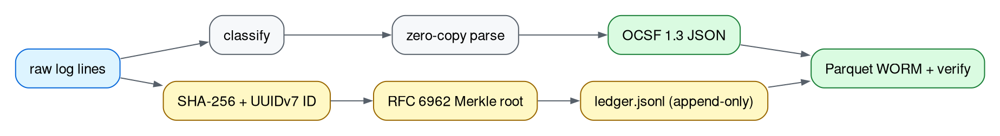
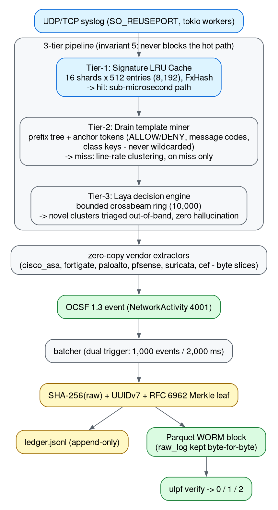

# Universal Log Pre-processing Framework (ULPF)

[](LICENSE)
[](https://www.rust-lang.org/)
[](#testing--verification-gate)
[](https://schema.ocsf.io/)
[](https://datatracker.ietf.org/doc/html/rfc6962)
[](#air-gapped-deployment)
[](#sih26156-requirements-matrix)
[](https://github.com/animishraa05/layaRustparser)

A high-performance, vendor-agnostic, containerized, strictly **air-gapped Universal Log Pre-processing Framework** written in **Rust**. ULPF ingests heterogeneous perimeter firewall logs, normalizes them into **OCSF 1.3 NetworkActivity (Class 4001)**, and cryptographically guarantees non-repudiation with **RFC 6962 Merkle trees** anchored into columnar **Apache Parquet WORM** storage — with every raw byte preserved, hash-for-hash, forever.



**Key capabilities**

- **Zero-copy hot path.** p50 is **2.88 µs**/line on the core corpus, **7.28 µs** at 224k lines (**−96.1% / −99.3%** vs the frozen baseline), **849,481 EPS** at full scale (**2.15×** baseline).
- **3-tier decision pipeline.** Tier-1 signature LRU (8,192 entries), Tier-2 Drain template miner with security anchor tokens, Tier-3 Laya triage on a bounded ring that **never blocks ingest** (invariant #5).
- **Lossless provenance.** Raw bytes are stored byte-for-byte in `raw_log`, `raw_hash = SHA-256(raw)` checks out on **all 224,657** full-scale lines, and every event gets a UUIDv7 `event_id`.
- **RFC 6962 Merkle WORM.** The append-only `ledger.jsonl` roots every Parquet block. Flip one byte and `ulpf verify` exits **2**; the live run passed **186/186** blocks.
- **One schema out: OCSF 1.3.** `NetworkActivity` (class 4001) for **6 formats today** (Cisco ASA, FortiGate, PAN-OS, pfSense, Suricata, CEF; [matrix](docs/WHY_ULPF.md#format--vendor-support-matrix)).
- **Action inviolability enforced on anchor tokens.** `ALLOW`/`PERMIT`/`ACCEPT` can never land in the same template cluster as `DENY`/`DROP`/`BLOCK`/`REJECT`; corpus-wide disposition purity is measured strictly in the [duel report](eval_duel_report.md).
- **Beats vanilla Drain 4–0.** The committed [duel](eval_duel_report.md) runs both engines over probe, fuzzed, BGL and Thunderbird rounds; 3-tier wins grouping accuracy on **all four** (e.g. 98.41% vs 71.73% on fuzzed input).
- **4,312× template compression.** 224,657 lines collapse to **32** Drain templates (baseline: 137,986) with template accuracy still at 100% — a ready-made feature table for any SIEM/ML system.
- **Air-gapped for real.** Zero outbound calls, no telemetry, no model downloads. One static **18.6 MB** binary (requirement: < 35 MB), plus Docker.

Every accuracy number links to a timestamped report from `ulpf evaluate`, and every table regenerates with one command (see [Reproduce the proof](#reproduce-the-proof)).

## Headline results (fresh, 2026-09-25)

All figures measured on the same machine (Linux x86_64, rustc 1.96.0), release build, `--engine all --duration 3 --threads 16`. Reports are committed; timestamps inside them prove freshness (core re-run 2026-09-25, other corpora 2026-09-24).

| Corpus | Lines | Accuracy (VCA / GA / TA / MeanAcc / Disposition) | p50 Baseline → 3-Tier | Throughput Baseline → 3-Tier | Audit dump |
| :--- | ---: | :--- | :--- | :--- | :---: |
| **Core** (committed fixtures) | 1,720 | **100 / 100 / 100 / 100 / 100 %** | 73.19 → **2.88 µs** (−96.1%) | 811,861 → 785,456 EPS (0.97×) | **0** |
| **Full scale** (regenerable) | **224,657** | **100 / 100 / 100 / 100 / 100 %** | 1,104.72 → **7.28 µs** (−99.3%) | 395,842 → **849,481 EPS (2.15×)** | **0** |
| **Adversarial** (fuzzed) | 757 | 96.30 / 98.41 / **100** / 97.15 / 93.53 % | 80.56 → **4.14 µs** (−94.9%) | 730,846 → 597,480 EPS (0.82×) | 382 ¹ |
| **Holdout** (frozen, one-shot) | 200 | 40 ² / 100 / **100** / 80 / 0 ² % | 74.47 → **5.63 µs** (−92.4%) | 1,721,640 → 154,514 EPS (0.09×) ³ | — |

¹ All 382 are **ground-truth-side mutation damage** — the fuzzer intentionally rewrote IP/port bytes; both engines produce *identical* mismatch counts (1,524 wrong fields each), so the delta is zero. Details: [`eval_adversarial_report.md`](eval_adversarial_report.md) §1b.
² Holdout vendors are intentionally unseen; the baseline recognises **0** — tiered recognises **40%** on structure alone and scores **320 GT fields correct vs baseline's 0**. Disposition is **0% on both engines by construction of the experiment**: the holdout's vendors have no extractor, so every event resolves to `Unknown` disposition (160/200 lines *do* carry labels — 102 Allowed / 58 Blocked — and both engines fail them all). Known gap, tracked as P10.2 vendor expansion. Details: [`eval_holdout_report.md`](eval_holdout_report.md) §1b–§3.
³ Holdout is a small (200-line) one-shot frozen audit — its throughput ratio is not a performance signal; latency percentiles there are (p50 −92.4%).

**Invariants held on every corpus, both engines:**

| Invariant | Result |
| :--- | :---: |
| **Action Inviolability** (`ALLOW`/`PERMIT`/`ACCEPT` never merges with `DENY`/`DROP`/`BLOCK`/`REJECT`) | **100% preserved** |
| **Lossless provenance** (`raw_hash == SHA-256(raw_log)`, byte-exact) | **100.00%** |
| **No panics** (`catch_unwind` around every parse) | **0 aborts / N lines** |
| **Sidecar ground truth, full scale** (5 field keys × 224,657 lines) | **1,000,000 correct · 0 wrong · 123,285 honest null** |
| **Live Merkle chain at scale** (P9 ingest run) | **186 / 186 blocks verify PASS** |

## Why ULPF

Traditional shippers fail three ways: the **context-switching wall** (interpreter-heavy pipelines collapse under attack traffic), the **"hash vault" forensic illusion** (per-row hashes prove nothing about the stream), and **proprietary schema lock-in**. ULPF answers with a Rust zero-copy hot path, RFC 6962 Merkle chaining (edit one byte anywhere → root breaks → `ulpf verify` exits 2), and OCSF 1.3 as the single output schema.

Full argument, shipper-by-shipper comparison, the [vendor support matrix](docs/WHY_ULPF.md#format--vendor-support-matrix) and one real line traced end to end: [`docs/WHY_ULPF.md`](docs/WHY_ULPF.md).

## Architecture



**Why two engines?** The frozen Aho-Corasick **baseline** (`UniversalParser`) is the control; the 3-tier pipeline runs on the same corpora and has to beat it on latency and accuracy at every scale (2.15× EPS at 224k; small-corpus exception noted in [Honest limitations](#honest-limitations)). Every scorecard prints both columns side by side, so no number is graded against itself. Workspace map (5 crates): [`AGENTS.md`](AGENTS.md#crate-map). Metric rulers, per-corpus scorecards, latency spectrum and forensic guarantees: [`docs/SCORECARDS.md`](docs/SCORECARDS.md).

## Reproduce the proof

```bash
git clone git@github.com:animishraa05/layaRustparser.git && cd layaRustparser
cargo build --release

# Accuracy scorecards — regenerates the non-frozen committed reports in ~90s
# (the holdout report is frozen at P8 and deliberately not re-runnable)
./target/release/ulpf evaluate --engine all --duration 3 --threads 16 --samples 10000 --out eval_hardcore_report.md --corpus core --data-dir data/raw
./target/release/ulpf evaluate --engine all --duration 3 --threads 16 --samples 10000 --out eval_adversarial_report.md --corpus adversarial --data-dir data/raw

# Full scale (dataset regenerable byte-for-byte, seed 777):
python3 scripts/gen_adversarial.py --full 25000
./target/release/ulpf evaluate --engine all --duration 3 --threads 16 --samples 10000 --out eval_full_report.md --corpus core --data-dir data/raw/full

# Integrity demo (exit 0 = valid, 2 = tampered; block_0 is the deliberate tamper)
./target/release/ulpf verify --file data/parquet/block_00001.parquet --ledger data/ledger.jsonl
./target/release/ulpf verify --file data/parquet/block_00000.parquet --ledger data/ledger.jsonl
```

> `evaluate`/`benchmark` need **release** builds on an idle machine: accuracy rows are deterministic, timing rows swing with load — hence the report timestamps. Exit codes: **0 valid · 1 IO error · 2 tamper**; console transcript in [`docs/SCORECARDS.md`](docs/SCORECARDS.md#cryptographic-chain-of-custody).

## Testing & verification gate

The project has **no CI** — this gate is the *only* automated check, and it runs before every commit:

```bash
cargo clippy --workspace --all-targets \
    -- -A clippy::too_many_arguments -A clippy::field_reassign_with_default -D warnings
cargo fmt --all -- --check
cargo test --workspace --no-fail-fast
```

**Latest run (2026-09-25): clippy 0 warnings · fmt clean · `124 passed · 0 failed · 1 ignored`.** Coverage: parser field accuracy + byte-exact SHA-256 per vendor, Drain anchor-token inviolability, the vanilla-vs-3-tier duel, tier behaviour, Merkle/tamper/exit-code contracts, CLI smoke tests, evaluator GT grading, air-gapped onboarder. The single `ignored` test is the documented load-sensitive micro-benchmark ([`AGENTS.md`](AGENTS.md) Gotchas).

## SIH26156 requirements matrix

| # | Requirement (verbatim from [`docs/SIH_EVALUATION_DOSSIER.md`](docs/SIH_EVALUATION_DOSSIER.md)) | Status | Evidence |
| :--- | :--- | :---: | :--- |
| a | Preserve complete raw event data without information loss | yes | `raw_log` byte-exact + `raw_hash == SHA-256(raw)` on **all 224,657** full-scale lines |
| b | Extract and parse source-specific attributes | yes | zero-copy extractors (ASA/FortiGate/PAN-OS/pfSense/Suricata/CEF) — **mean field accuracy 100%** on core & full ([rulers](docs/SCORECARDS.md#how-every-metric-is-measured-the-rulers)) |
| c | Normalize fields into a common event taxonomy | yes | OCSF 1.3 `NetworkActivity` 4001 — **100% VCA** on core, adversarial-vendor-match, full |
| d | Maintain traceability between normalized and original events | yes | UUIDv7 `event_id` + SHA-256 digest on every event; `inspect` demo (quick start 6) |
| e | Plug-and-play onboarding of new log sources | yes | `ulpf onboard` — 3–5 sample lines → validated parser spec, zero network (quick start 7) |
| f | Unified visibility across enterprise environments | yes | 5 vendor families → uniform OCSF JSON + Parquet schema ([data locations](#data-locations--programmatic-access)) |
| g | Efficient SIEM and Data Lake integration | yes | Parquet WORM blocks, queryable via DuckDB/pandas ([snippet](#data-locations--programmatic-access)) |
| h | AI/ML-ready security and operational analytics | yes | **32 Drain templates from 224,657 lines (4,312× compression)** — pre-clustered feature IDs ([scorecards](docs/SCORECARDS.md)) |
| i | Reduced parser development effort | yes | sample file → parser spec in **ms**, not days (quick start 7) |
| j | Deployable in an air-gapped network | yes | single self-contained binaries, **zero** outbound calls anywhere in the runtime path |
| k | Packaged in a container for platform independence (target < 35 MB) | partial | binary **18.6 MB, within the 35 MB target** (`ls -la target/release/ulpf`); container slim-down in progress — roadmap P10.7 |

Full dossier with per-requirement narrative: [`docs/SIH_EVALUATION_DOSSIER.md`](docs/SIH_EVALUATION_DOSSIER.md).

## Air-gapped deployment

```bash
docker build -t ulpf .
# or
docker compose up -d        # publishes 5140/udp + 5140/tcp, mounts ./data
```

- [`Dockerfile`](Dockerfile): multi-stage build → slim runtime, binaries at `/usr/local/bin`, no network calls at any point in the runtime path.
- [`docker-compose.yml`](docker-compose.yml): isolated `ulpf-net` bridge, persistent `./data/parquet` + `./data/ledger.jsonl` mounts, `restart: unless-stopped`.
- Strictly air-gapped: **zero** outbound calls — no telemetry, no model downloads, no license checks.

## Quick start

After `cargo build --release`, one command gives the full picture — both engines over the committed corpus, one aligned box you can screenshot (throughput, latency deltas, accuracy audit, the vanilla-vs-3-tier duel, PASS/FAIL gates, plain-words verdict), plus `scorecard_report.md` (regenerable, not committed):

```bash
./target/release/ulpf scorecard
```

Full walkthrough:

```bash
# 1. Build (rustc 1.96, edition 2021, stable toolchain)
cargo build --release

# 2. Run the accuracy evaluator — every metric in one Markdown report
./target/release/ulpf evaluate --engine all --duration 3 --threads 16 --samples 10000 --out report.md --corpus core --data-dir data/raw

# 3. Live ingest: start the engine (UDP+TCP on 5140, batch 1000 / 2000ms)
./target/release/ulpf ingest --udp 0.0.0.0:5140 --tcp 0.0.0.0:5140 --parquet-dir data/parquet --ledger data/ledger.jsonl

# 4. In another terminal: blast it with 5 vendors of synthetic traffic
./target/release/ulpf-generator -t 127.0.0.1:5140 -p udp -r 50000 -d 10 -D all

# 5. Verify the Merkle chain (exit 0 = PASS, 2 = tampered)
./target/release/ulpf verify --file data/parquet/block_00001.parquet --ledger data/ledger.jsonl

# 6. Inspect one forensic record (UUIDv7, raw bytes, OCSF output)
./target/release/ulpf inspect --file data/parquet/block_00001.parquet --count 1

# 7. Air-gapped onboarding of an unseen format (3–5 sample lines, no internet)
./target/release/ulpf onboard --sample sample_new_firewall.log --vendor juniper --model srx --out data/parsers

# 8. End-to-end scripted demo (writes to scratch data/demo/, never touches fixtures)
bash scripts/run_demo.sh
```

## CLI reference

`ulpf --help` is authoritative; the summary below is transcribed from it.

| Subcommand | Purpose | Key flags (defaults) |
| :--- | :--- | :--- |
| `ingest` | Live Syslog UDP/TCP → OCSF → Merkle → Parquet | `--udp 0.0.0.0:5140` · `--tcp 0.0.0.0:5140` · `--parquet-dir data/parquet` · `--ledger data/ledger.jsonl` · `--batch-size 1000` · `--batch-timeout 2000` · `--reuse-port` |
| `verify` | Audit a Parquet block against the ledger | `--file <block.parquet>` · `--ledger data/ledger.jsonl` · **exit 0/1/2** |
| `onboard` | Synthesize + validate a parser from sample lines | `-s/--sample <file>` · `-v/--vendor <name>` · `-m/--model <name>` · `-o/--out data/parsers` |
| `benchmark` | Multi-core parse/normalize throughput | `--data-dir data/raw` *(long-only)* · `-d/--duration 5` · `-t/--threads 16` · `--compare` |
| `evaluate` | Baseline vs 3-Tier scorecard + percentiles + cache stats | `-e/--engine {all,baseline,tiered}` · `--corpus {core,adversarial,holdout}` · `--data-dir data/raw` · `-d/--duration 3` · `-t/--threads 16` · `-s/--samples 10000` · `-o/--out report.md` · `--json-out` · `--audit-dump` |
| `scorecard` | One-command side-by-side scorecard box: throughput, latency deltas, accuracy audit, vanilla-vs-3-tier duel, PASS/FAIL gates, verdict + markdown reports | `--corpus {core,adversarial,holdout}` · `--data-dir data/raw` · `-d/--duration 3` · `-t/--threads 16` · `-s/--samples 10000` · `-o/--out scorecard_report.md` |
| `inspect` | Print forensic records from a block | `-f/--file <block.parquet>` · `-c/--count 1` |
| `tamper` | Adversarial edit of a stored record (attack simulator) | `-f/--file <block.parquet>` · `-l/--leaf 0` · `-i/--ip 10.99.99.99` |

`ulpf-generator`: `-t/--target <IP:PORT>` · `-p/--proto {udp,tcp}` · `-r/--rate <EPS>` (0 = max) · `-d/--duration <sec>` (0 = infinite) · `-D/--dataset {all,cisco,fortigate,paloalto,suricata,pfsense,kaggle}` · `-w/--workers <N>` · `--data-dir <PATH>` (auto-located from cwd). Flags via `ulpf-generator --help`.

## Data locations & programmatic access

| Path | Contents |
| :--- | :--- |
| `data/raw/` — `*.log` + `suricata.json` (1,720 lines = the `core` corpus) | Cisco ASA (+VPN), FortiGate (+UTM), Palo Alto (+threat), pfSense (+IPv6), Suricata EVE — plus `kaggle_firewall.csv` (2,001 real-world rows, not in eval glob) |
| `data/raw/adversarial/` (757) · `data/raw/duel/` | Deterministic fuzz corpus + `gt.jsonl` sidecar; duel fixtures (probe + LogHub BGL/Thunderbird samples, attribution inside) |
| `data/raw/holdout/` (200) | **Frozen** unseen-vendor corpus + sidecar — never regenerate |
| `data/raw/full/` (224,657, gitignored) | Full-scale dataset: `python3 scripts/gen_adversarial.py --full 25000` (seed 777, md5-reproducible) |
| `data/parquet/block_*.parquet` · `data/ledger.jsonl` | WORM blocks (`block_00000` = tampered demo, `block_00001` = valid) · append-only Merkle roots |
| `data/parsers/` | Onboarder output (gitignored) |

**Programmatic access** — Parquet is a first-class analytics format: `duckdb -c "SELECT vendor, count(*) FROM 'data/parquet/*.parquet' GROUP BY vendor;"` or `pandas.read_parquet(...)`. Schema ([`ulpf-integrity/src/storage.rs`](crates/ulpf-integrity/src/storage.rs)): `event_id · block_id · leaf_index · timestamp · vendor · raw_log · raw_hash · ocsf_json`.

## Honest limitations

Known gaps, each one measured:

- **Adversarial GA: 98.41% vs baseline 100%** (−1.59 pt) — deny-class template variants cluster together on the fuzz corpus; Action Inviolability itself stays 100% (no ALLOW/DENY ever merges). Fix tracked as a stretch item (deny-class sub-clustering).
- **Corpus-wide mixed-action clusters on fuzzed lines (duel finding).** On R2, 10 of 81 clusters (vanilla: 17 of 53) still hold both dispositions: relay/CR-prefixed records keep a space, the tokenizer fuses the CSV/JSON into one token, and the buried action word never reaches the anchor vocabulary. The 100% inviolability gate is the bare-token canary; root cause and scope are disclosed in [`eval_duel_report.md`](eval_duel_report.md) — deliberately **not tuned away** on the corpus that exposed it (a fix must be validated on unseen data).
- **Holdout disposition = 0/0** — the frozen holdout's vendors are *unseen* (no extractor exists for them), so both engines emit `Unknown` disposition on all 200 lines even though 160 carry ground-truth labels. It's an honest zero, not a skipped grade; vendor expansion (P10.2) is the fix.
- **Small-corpus throughput ratio ≈ 0.82–0.97×** — on 757–1,720 line corpora the tiered engine pays Drain bookkeeping that the pure baseline skips; at 224k+ lines the tiers pay off (**2.15×**). Latency wins at *every* scale (−92% to −99% p50).
- **Throughput/latency are load-sensitive** — same-code reruns swing baseline p50 between ~73 µs (idle) and ~1,104 µs (busy). Accuracy is deterministic; timing is not. Reports embed timestamps for this reason.
- **Full-scale p50 (7.28 µs) is over the 5.0 µs latency gate.** The gate is calibrated on the core corpus, where p50 is 2.88 µs and passes. At 224,657 lines the working set no longer stays cache-resident (still −99.3% vs baseline). The gate stays where it is; the gap is tracked in the roadmap.
- **UDP socket ceiling ≈ 25–28k EPS/socket** in the live generator path (kernel-bound); the evaluator's in-process numbers are the engine's own capacity.
- **Container image not yet < 35 MB** — binary requirement met (18.6 MB); distroless/musl slim-down is roadmap P10.7.
- One test is load-flaky by design (`test_classification_sub_microsecond_benchmark`, `ignored`) — documented in [`AGENTS.md`](AGENTS.md).

## Documentation map

| Document | What it gives you |
| :--- | :--- |
| [`docs/WHY_ULPF.md`](docs/WHY_ULPF.md) | The problem, shipper comparison, vendor support matrix, one real line end to end |
| [`docs/SCORECARDS.md`](docs/SCORECARDS.md) | Metric rulers, per-corpus scorecards, latency spectrum, forensic guarantees |
| [`FULL_DATASET_RESULTS.md`](FULL_DATASET_RESULTS.md) | 224,657-line end-to-end run: evals, live 186-block chain, onboarding, what we found wrong |
| [`OVERHAUL_PLAN.md`](OVERHAUL_PLAN.md) | The P1–P10 measurement-first overhaul plan + per-phase execution log |
| [`AGENTS.md`](AGENTS.md) | Contributor handbook: invariants, crate map, verification gate, gotchas, extension recipes |
| [`docs/ARCHITECTURE.md`](docs/ARCHITECTURE.md) | High-assurance architecture spec: data plane, integrity plane, math-grade reasoning |
| [`docs/diagrams/`](docs/diagrams/) | Graphviz `.dot` sources + rendered `.png` for every diagram (regenerate with `dot -Tpng -Gdpi=144`) |
| [`docs/SIH_EVALUATION_DOSSIER.md`](docs/SIH_EVALUATION_DOSSIER.md) | Requirement-by-requirement defense dossier (a–k) + out-of-scope honesty section |
| [`docs/SIMPLIFIED_EXPLANATION_AND_BENCHMARKS.md`](docs/SIMPLIFIED_EXPLANATION_AND_BENCHMARKS.md) | Plain-language guide (airport analogy) + benchmark deep-dive for non-experts |
| [`docs/DETAILED_IMPLEMENTATION_VS_PROPOSAL.md`](docs/DETAILED_IMPLEMENTATION_VS_PROPOSAL.md) | Implemented system vs original proposal, subsystem by subsystem |
| [`docs/PRESENTATION.md`](docs/PRESENTATION.md) · [`docs/DEMO.md`](docs/DEMO.md) | 5-slide presentation script · 2-minute demo video script · [printable PDFs in `docs/`](docs/) |
| [`eval_hardcore_report.md`](eval_hardcore_report.md) · [`eval_full_report.md`](eval_full_report.md) · [`eval_adversarial_report.md`](eval_adversarial_report.md) · [`eval_holdout_report.md`](eval_holdout_report.md) · [`eval_duel_report.md`](eval_duel_report.md) | The committed accuracy scorecards + the vanilla-vs-3-tier duel this README cites |
| [`scripts/run_demo.sh`](scripts/run_demo.sh) | One-command non-destructive demo |

## Project status & roadmap

**Done (P1 → P10.0):** measurement-first ruler fixes → vendor extractors → CEF → parse-order/LRU tiers → audit null-correct rules → dynamic message-code anchors → GA/TA to 100 both engines → deterministic adversarial + frozen holdout corpora → sidecar ground truth → full-scale 224,657-line validation → 186-block live chain → CLI hardening → ASA verdict-phrase union → fresh re-run evidence → vanilla-vs-3-tier duel surfaced in `ulpf scorecard`.

**In progress (P10):** universal wire formats (LEEF, generic KV/JSON/XML, RFC5424 SD) · vendor expansion (~10, ISRO-relevant) · multi-source measurement + Mapping-Coverage metric · container < 35 MB (P10.7) · submission artifacts (readme/pitch/video) · deny-class GA stretch (P10.9, droppable).

**Performance gates** (checked whenever hot path/miner changes): p50 < 5.0 µs *(core-corpus: 2.88 µs passes; full-scale 7.28 µs is over the line, tracked above)* · LRU hit rate > 90% · Action Inviolability 100% · grouping accuracy > 90%.

## License

Apache-2.0 — see [`LICENSE`](LICENSE).
