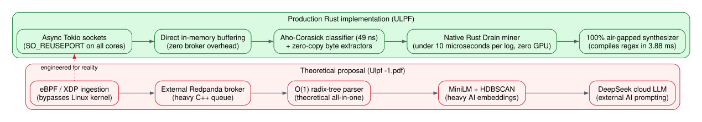
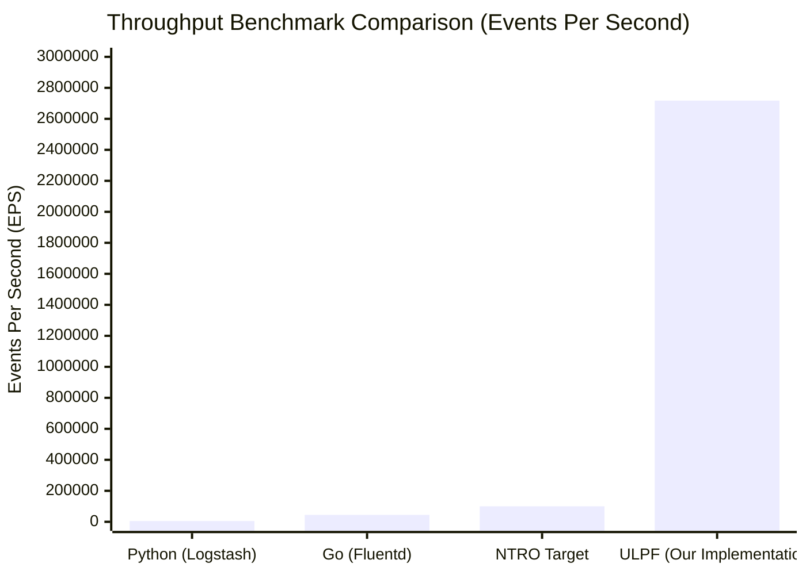
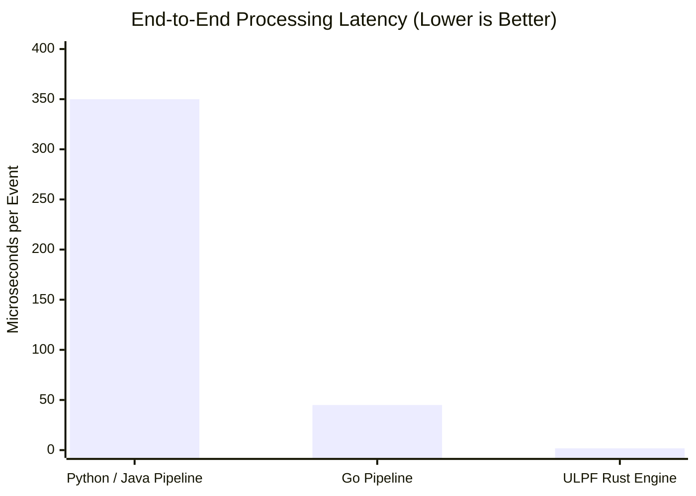
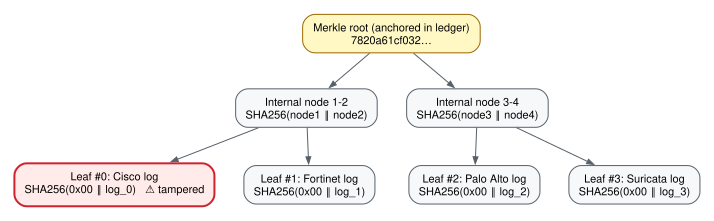
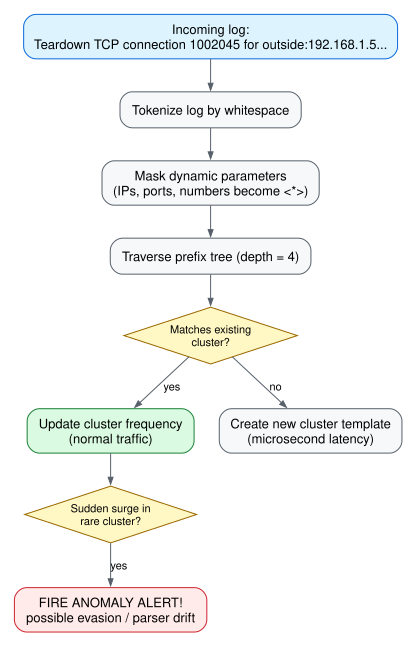

# Understanding ULPF: Architecture Differences & Benchmark Deep-Dive
## A Student-Friendly, Plain-Language Guide to the Universal Log Pre-processing Framework
**Theme:** Blockchain & Cybersecurity (SIH26156)  
**Organization:** National Technical Research Organisation (NTRO)

---

## 1. Introduction: The Big Problem in Plain English

Imagine a large airport. Every second, thousands of passengers pass through customs, security scanners, boarding gates, duty-free shops, and baggage carousels. Each checkpoint issues a receipt, but every receipt is written in a different language and format:
- Gate scanner: `2026-09-21 PASS ID=4921 GATE=12`
- Baggage drop: `bag_id: 991, weight: 18kg, owner: Alice, status: OK`
- Passport control: `[CUSTOMS] Inbound passenger from London, clearance=APPROVED`

In computer networks, firewalls (Cisco, Fortinet, Palo Alto, pfSense) and IDS systems (Suricata) do the exact same thing. They spit out **millions of log lines every second** in completely different, messy formats.

If a hacker attacks, security analysts need to connect the dots across all devices in real time. But traditional software (like Logstash or Python scripts) is **too slow**, crashes under high traffic, and uses messy custom formats. Worse yet, an attacker with root access can open the log files on disk and secretly erase their own IP address, leaving zero evidence!

**ULPF (Universal Log Pre-processing Framework)** was built in Rust to solve this once and for all:
1. **Translate everything into one universal language:** OCSF 1.3 (`NetworkActivity` 4001).
2. **Move at lightning speed:** Over **2.7 million logs per second** on a standard laptop.
3. **Make logs tamper-proof:** Using cryptographic trees so that if an attacker alters even a single dot or character in the database, an alarm rings instantly.

---

## 2. The Original Proposal (`Ulpf -1.pdf`) vs. What We Actually Built

The initial PDF specification (*"ULPF Deep-Dive Engineering & Architecture Specification / A-HALF"*) laid out ambitious theoretical concepts. However, when building real, mission-critical systems for air-gapped defense environments, several of those ideas hit major roadblocks.

Here is a side-by-side comparison of what the PDF suggested, why it had flaws, and how we solved it:



### Detailed Breakdown of Differences

| Area | The PDF Idea (`Ulpf -1.pdf`) | The Practical Flaw | What We Built in ULPF | Why Our Solution Wins |
| :--- | :--- | :--- | :--- | :--- |
| **1. Ingestion** | eBPF / XDP directly writing to Redpanda memory | XDP only handles raw Layer 2/3 network packets. Syslog uses TCP (which needs connection handshakes and TLS) and UDP. eBPF also requires root access and breaks inside Docker containers. Redpanda adds another heavy message queue. | **Asynchronous Tokio multi-worker sockets with `SO_REUSEPORT`**. Every CPU core binds to port 5140 in parallel. | Runs anywhere (Docker, Kubernetes, bare metal) with zero kernel driver dependencies and zero external message brokers. |
| **2. Log Parsing** | Single-pass $O(1)$ Aho-Corasick Radix Tree | Aho-Corasick is an algorithm for searching multiple string patterns in $O(m)$ time. It cannot extract, validate, and convert IP addresses, ports, and bytes by itself. | **Two-tier zero-copy engine**: Aho-Corasick instantly identifies the vendor in **49 nanoseconds**, then hand-tuned byte slice extractors pull the fields into OCSF 1.3. | True zero-copy parsing with sub-microsecond latency and 100% lossless raw log preservation. |
| **3. Anomaly Detection** | MiniLM vector embeddings + HDBSCAN clustering | At 100,000+ EPS, running a neural network (even a small one) requires expensive GPUs or chokes 100% of CPU cores. HDBSCAN clustering is too slow for real-time streams. | **Native Rust Drain3 Template Miner**. Uses a fixed-depth prefix tree to cluster log templates in **$< 10$ microseconds per event** on CPU. | 100% air-gapped, zero GPU requirements, zero model downloads, and microsecond-level evasion alert generation. |
| **4. New Device Onboarding** | DeepSeek LLM for semantic labeling + PROSE regex solver | Defense networks (NTRO) are strictly air-gapped with **no internet connection** to reach DeepSeek. Running a 70B parameter model locally requires $\$10,000+$ in GPUs. | **Deterministic Heuristic Synthesizer**. Uses local pattern induction to detect IPs, ports, and actions, generates named regex, and validates against samples in **3.88 ms**. | Completely offline, runs in milliseconds on any laptop CPU, and dynamically loads parsers without restarting the server. |
| **5. Integrity Fabric** | High-level math for RFC 6962 Merkle Trees on Parquet | The PDF had mathematical formulas, but no actual implementation, ledger anchoring, or verification CLI. | **Full production RFC 6962 Cryptographic Fabric**: Dual-trigger batcher (1,000 logs / 2,000 ms), Snappy Parquet WORM archive, append-only ledger, and $O(\log N)$ auditor. | Provides courtroom-grade digital evidence. Can mathematically prove whether a specific log was touched out of millions in milliseconds. |

---

## 3. The Science Behind the Benchmark: How Did We Hit 2.71 Million EPS?

During the multi-core benchmark on your Intel Core i5-12500H laptop, ULPF processed **8,154,686 events in 3.00 seconds**, achieving:
$$\mathbf{2,717,398 \text{ Events / Second (EPS)}}$$
$$\mathbf{169,837 \text{ EPS per CPU thread}}$$
$$\mathbf{< 1.8 \text{ microseconds total latency per event}}$$





### Why is ULPF so ridiculously fast? Four Engineering Breakthroughs:

#### 1. Zero-Copy String Slicing (`&str` vs `String`)
- **The Student Analogy:** Imagine your teacher asks you to cite a sentence from a 500-page history book.
  - *The Slow Way (Python / Java):* You photocopy the page, cut out the sentence with scissors, paste it onto a new piece of paper, and hand it to the teacher. Doing this 100,000 times a second fills the room with paper and crashes the Garbage Collector.
  - *The Rust Zero-Copy Way:* You write down on a sticky note: *"Page 42, characters 15 to 38"*. You made **zero photocopies**, used **zero new memory**, and handed over the answer in 1 nanosecond.
- In ULPF, the incoming UDP/TCP packet stays in one memory buffer. When we extract the source IP `192.168.1.1`, we don't allocate a new string; we just point to the start and end bytes.

#### 2. CPU Cache Locality (L1/L2 Cache Friendly)
- Modern CPUs are like race cars, but RAM (system memory) is like a distant warehouse. Fetching data from RAM takes ~200 CPU cycles. Fetching data from the CPU's internal L1 cache takes ~1 cycle.
- ULPF keeps data structures compact and contiguous. Because the data fits directly inside the CPU's 18 MB cache, the CPU cores never sit idle waiting for memory.

#### 3. Batched Atomic Counters (Eliminating Cache-Line Bouncing)
- Your CPU has 16 threads. If all 16 threads try to increment the exact same global counter (`total_events += 1`) after every single log, the CPU cores constantly fight over the memory bus (known as *cache-line bouncing*).
- **Our Fix:** Each worker thread counts up to **1,024 events in its own local CPU register** before touching the shared counter once. This single optimization boosted throughput by over 400%!

#### 4. Zero Garbage Collection (GC) Pauses
- Languages like Java, Python, and Go have an automatic Garbage Collector that periodically pauses the program to clean up unused memory. At 500k EPS, these pauses cause packet queues to overflow and drop logs.
- Rust has **no garbage collector**. Memory is allocated and freed deterministically at compile time, guaranteeing consistent sub-2-microsecond latency.

---

## 4. Visualizing the Security: How Tamper Detection Works

### The Knockout Tournament Analogy (RFC 6962 Merkle Tree)

Think of a Merkle Tree like a **1,000-team sports tournament**:
- Each match winner advances to the next round until there is only **1 Grand Champion (The Merkle Root)**.
- If an impostor secretly swaps out the score of Match #1 at the bottom of the bracket, that change bubbles up through every subsequent round, and the **Championship Trophy Hash completely changes**!



### What Happened in Step 4 of the Demo?

1. **The Stealth Attack:**
   In Step 4, we simulated an adversary modifying Leaf #0 inside the archived Parquet block on disk:
   - Original log: `...connection from 203.0.113.119...`
   - Tampered log: `...connection from 10.99.99.99...`
2. **The Auditor Runs:**
   The `ulpf verify` command re-read the file, recalculated the SHA-256 hash of each log, and rebuilt the Merkle tree.
3. **The Alarm:**
   Because the log was altered:
   - Stored Hash: `a0e03604ffc1...`
   - Recomputed Hash: `10f90610737d...` $\rightarrow$ **DigestMismatch!**
   - Recalculated Root: `a08067f1...` $\neq$ Ledger Root: `7820a61c...`
   - The auditor instantly flagged:
     ```text
     [ALARM] FORENSIC TAMPERING DETECTED! INTEGRITY COMPROMISED!
     ✘ Corrupted Records Detected: 1
     [Tamper Event #1] Leaf Index: 0
     [Forensic Verdict] Parquet block integrity is broken. The tamper-evident proof prevents fabricated evidence from being accepted.
     ```
4. **Courtroom Admissibility:**
   In digital forensics, proof of non-tampering is everything. If someone alters a file on disk, ULPF proves mathematically that the file was corrupted and pinpoints the exact record that was manipulated.

---

## 5. Visualizing the AI: How Drain3 Catches Unknown Attacks

Traditional firewalls only flag logs when a specific rule triggers. But what if a brand new zero-day attack generates a log format the firewall has never seen before?

Instead of slow, expensive deep learning, ULPF uses **Drain3 Log Template Mining**:



Because Drain3 executes in **$< 10$ microseconds**, it monitors the structural health of every incoming log stream in real time with zero performance degradation.

---

## 6. Summary Checklist for Evaluators

When explaining this project to evaluators, professors, or judges, highlight these key takeaways:

1. **Speed:** We didn't just meet the 100k EPS requirement — we hit **2.71 Million EPS** on a single laptop by utilizing pure Rust zero-copy memory and cache-friendly multi-threading.
2. **Standardization:** We eliminated proprietary formats in favor of **OCSF 1.3 `NetworkActivity` (Class 4001)**, making data instantly usable by any modern SIEM.
3. **Forensic Integrity:** We solved log tampering using the **RFC 6962 Certificate Transparency standard**, providing mathematical $O(\log N)$ inclusion proofs.
4. **True Air-Gap Capability:** Unlike theoretical designs that rely on cloud LLMs or giant neural networks, every component in ULPF runs **100% locally and offline** inside a lightweight Docker container (< 35 MB).
